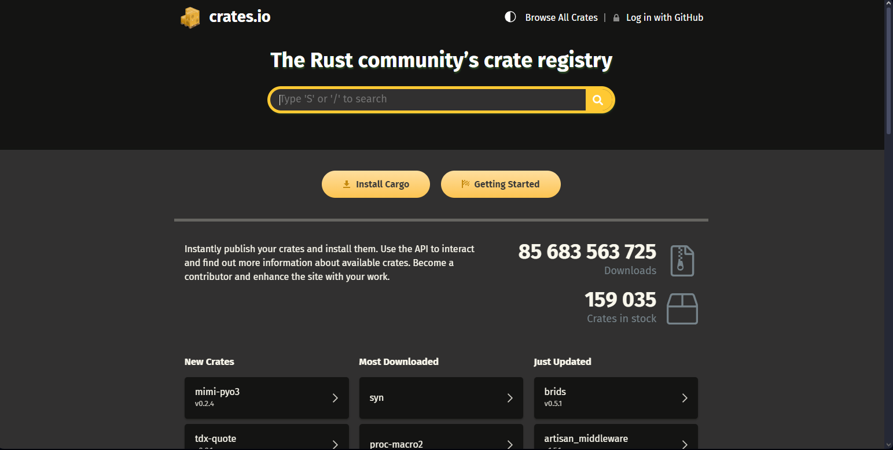
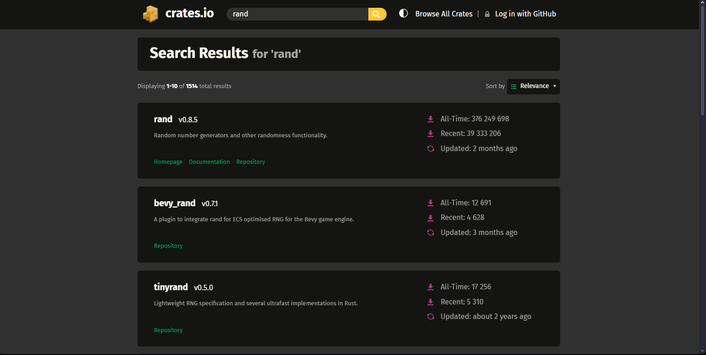
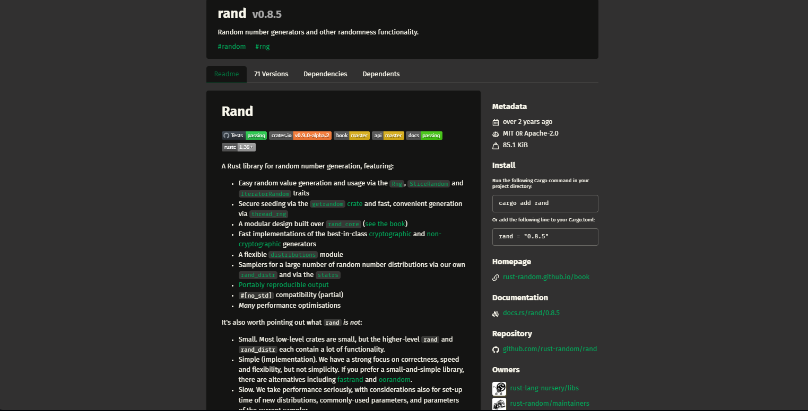
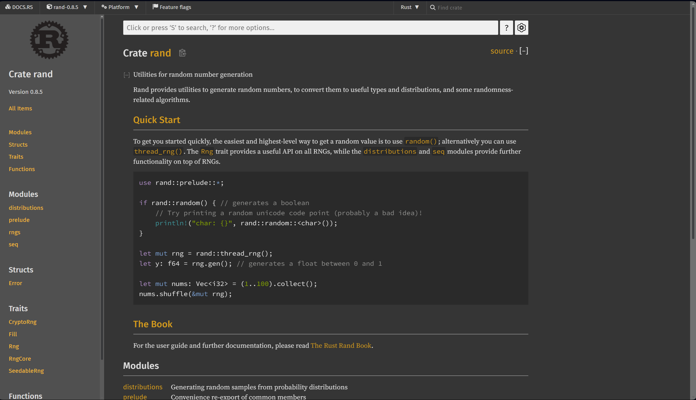
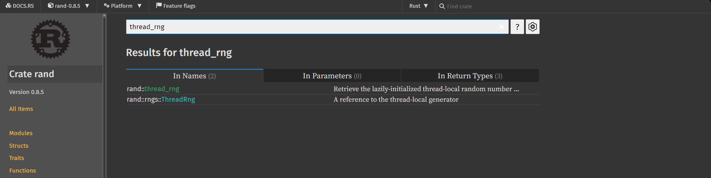
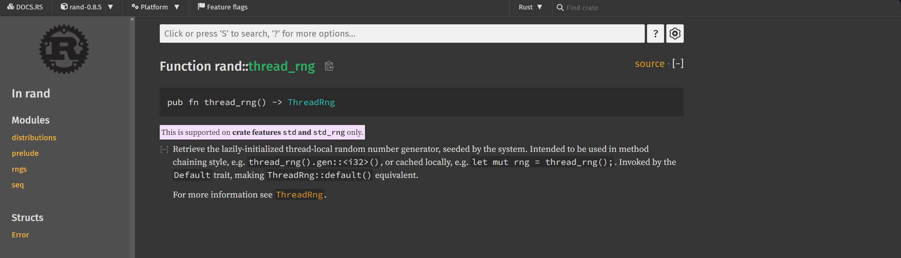

### 1. Що таке Crates.io?

Crates.io — це офіційний репозиторій для пакетів на Rust (реєстр пакетів), відомих як крейти. Це основне джерело для пошуку, завантаження та публікації крейтів.

### 2. Переходимо на сайт Crates.io

Відкрийте браузер і перейдіть за посиланням: [Crates.io](https://crates.io/).

На головній сторінці ви побачите популярні та нещодавно оновлені крейти.



### 3. Пошук крейта

Щоб знайти необхідний крейт, скористайтеся рядком пошуку. Наприклад, спробуємо знайти крейт для роботи з випадковими числами. У полі пошуку введіть `rand` і натисніть Enter.



### 4. Перегляд інформації про крейт

Коли ви знайдете потрібний крейт, наприклад, `rand`, натисніть на його назву в результатах пошуку. На сторінці крейта ви побачите:

- Опис крейта.
- Поточну версію.
- Інструкції для використання.
- Статистику завантажень та популярність.
- Документацію та посилання на код на GitHub.
- Посилання на розробників



### 5.Версія крейту

Остання версія rand — це "0.8.5". За замовчуванням, версія крейту вказана у форматі `0.8`, де `0.8` фіксує основну та мінорну версії, а `5` — це патч-версія (білд). Це означає, що при оновленні автоматично буде вибрана новіша версія патчу (наприклад, `0.8.6`), якщо вона стане доступною. Основна та мінорна версії залишаться фіксованими.

### 6. Дослідження інших крейтів

Crates.io містить тисячі крейтів для різних задач: від роботи з HTTP-запитами до криптографії. Щоб дізнатися більше про можливості Rust, ви можете дослідити категорії або скористатися пошуком за тегами.

### 7. Пакетний менеджер

Важливо знати, як пакети потрапляють на Crates.io. Це здійснюється через пакетний менеджер Cargo. Він автоматично завантажує всі залежності для вашого проєкту з Crates.io, що спрощує процес управління бібліотеками. Крім того, через Cargo ви можете завантажити свій власний крейт на Crates.io. Хоча модерація існує, вона переважно непомітна. Однак, якщо ваш крейт порушує правила, ваш обліковий запис може бути заблоковано, і ви не зможете публікувати нові крейти.

Зверніть увагу, що для публікації крейту не обов'язково мати репозиторій Git, оскільки завантажуються безпосередньо файли проєкту, а не посилання на репозиторій.

### 8. Доступ до документації

Більшість крейтів мають детальну документацію. Для перегляду натисніть кнопку `Documentation` на сторінці крейта на Crates.io, що перенаправить вас на сайт docs.rs, де зберігаються автоматично згенеровані документи.

### 9. Що таке Docs.rs?

Docs.rs — це вебсайт, на якому автоматично генерується і зберігається документація для всіх опублікованих крейтів з Crates.io. Це зручний ресурс для перегляду API та інструкцій по використанню крейтів.

### 10. Читання документації

Документація на docs.rs зазвичай містить:

- **API референс**: всі публічні функції, структури та інші елементи крейта.
- **Приклади використання**: часто ви знайдете приклади коду, які допоможуть вам зрозуміти, як використовувати крейт.
- **Опис функціоналу**: докладні пояснення основних концепцій та можливостей крейта.

### 11. Пошук по документації

На сайті docs.rs ви можете шукати інформацію як за конкретним крейтом, так і по всій доступній документації. У верхньому правому куті є рядок пошуку, де ви можете вводити назви крейтів, і шукати їх прямо на Docs.rs. Також з верху є рядок пошуку для функцій, структур чи інших елементів. Це допоможе вам швидко знайти необхідні API чи приклади використання.

### 12. Приклад пошуку

1. Перейдіть на сторінку документації крейта `rand` на сайті docs.rs : [rand документація](https://docs.rs/rand).
   
2. У рядку пошуку вгорі введіть "thread_rng". Це функція для отримання випадкового генератора чисел у потоці.
   
3. Натисніть Enter і виберіть відповідний результат зі списку. Ви побачите опис функції, приклади використання та деталі про те, як вона працює.
   

Такий пошук дозволяє швидко знаходити необхідні елементи навіть у великих крейтах.

### 13. Відкритий код та внески

Також Crates.io зазвичай містить посилання на GitHub репозиторій для кожного крейта, де ви можете переглядати код, повідомляти про проблеми або навіть робити внески до проекту.

### 14. Додавання крейта до вашого проекту

Щоб використати крейт у своєму проекті, потрібно додати його до файлу `Cargo.toml`. Наприклад, для `rand` це буде виглядати так:

```toml
[dependencies]
rand = "0.8"
```

Це вказує Cargo, що ваш проект залежить від версії `0.8` крейта `rand`.
