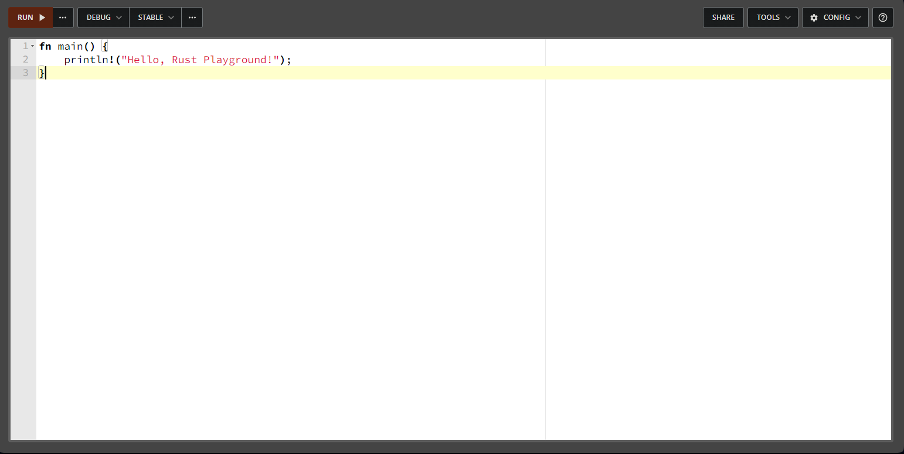
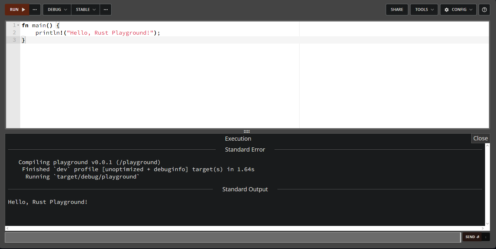
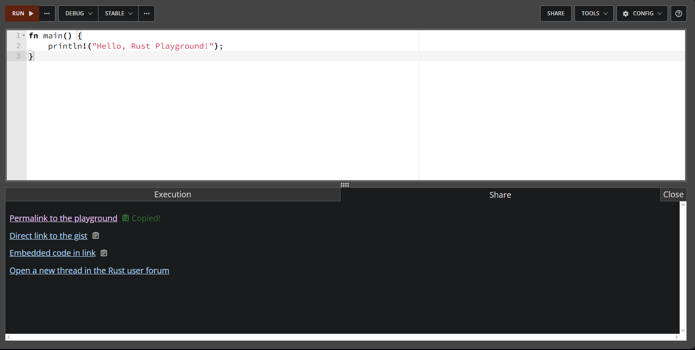
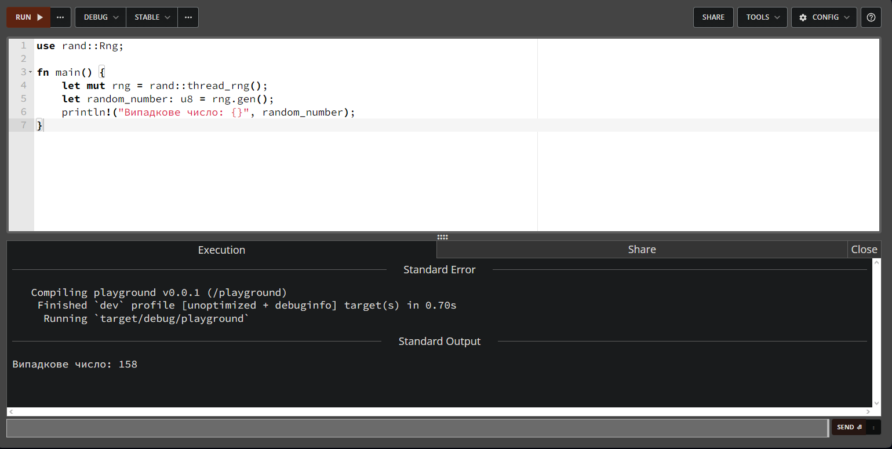
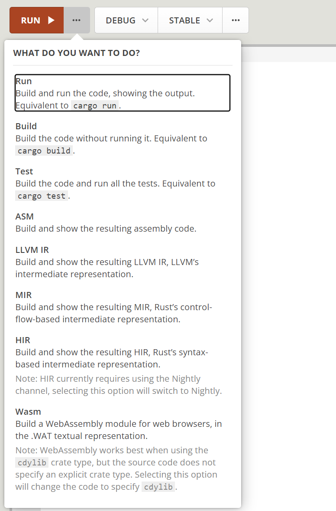
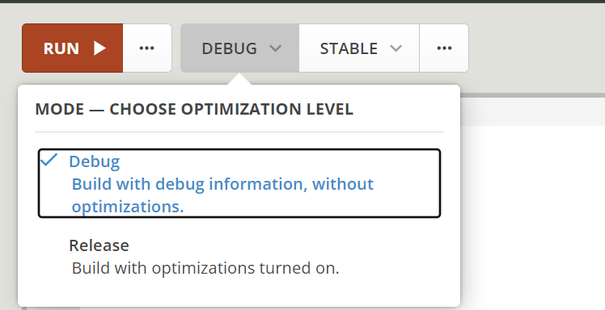
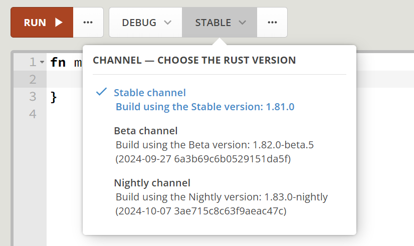

### 1

Переходимо за посиланням [Rust Playground](https://play.rust-lang.org/).

### 2

Відкриється середовище, де можна писати та запускати код на Rust. Напишемо просту програму:

```rust
fn main() {
    println!("Hello, Rust Playground!");
}
```



### 3

Для запуску програми натискаємо кнопку `Run`. Та побачимо вивід программи



### 4

Щоб поділитись кодом з іншими, треба натиснути на кнопку `Share`. І у вікні, що з'явилося, натиснути `Permalink to the playground` та скопіювати посилання.



### 5

Після цього згенерується унікальне посилання, яким можна поділитись з іншими розробниками.

### 6

Також можна налаштувати параметри компіляції або підключати додаткові крейти.
Rust Playground має обмежену кількість вбудованих крейтів. Зокрема, доступні 100 найбільш завантажених крейтів усіх часів.
Наприклад, додамо популярний крейт `rand` для генерації випадкових чисел.

### 7

Можемо використати крейт `rand` у нашому коді:

```rust
use rand::Rng;

fn main() {
    let mut rng = rand::thread_rng();
    let random_number: u8 = rng.gen();
    println!("Випадкове число: {}", random_number);
}
```



### 8

Спробуйте самостійно додати крейт, запустити програму та поділитись результатом з другом.

### 9

Тепер розглянемо детальніше додатковий функціонал.
При натисканні трьох крапочек біля `run` відкривається віконце в якому можна вибрати спосіб запуску вашого коду. Це може бути запуск тестів, чи просто спроба збілдити ваш код. Також підтримуються такі можливості як: `ASM`, `LLVM IR`, `MIR`, `HIR`, `Wasm`



### 10

Потім ви можете вибрати з якою оптимізацією білдити код. `Debag` чи `Release`



### 11

Також є можливість вибрати версію компілятора, будь то `beta` `stable` чи `nightly`.



### 12

І також ви можете вибрати декілька варіантів інструментів. У доступі є:

- `Rustfmt` - це інструмент для автоматичного форматування коду в стилі, який відповідає офіційним стандартам Rust.
- `Clippy` – статичний аналізатор, який надає рекомендації щодо покращення вашого коду, зокрема допомагає уникнути поширених помилок, покращує ефективність, зручність читання та відповідність стилю Rust.
- `Miri` – інтерпретатор, що дозволяє запускати та перевіряти код Rust на рівні інтерпретації, що допомагає виявляти помилки, пов’язані з небезпечною поведінкою, такими як помилки в обробці пам’яті або синхронізації потоків.
- `Expand macros` – інструмент, що розширює макроси в коді, дозволяючи побачити їх реальне розгортання після компіляції, що може бути корисним для відладки та розуміння складних макросів.

Ці інструменти можуть допомогти вам підвищити якість, безпеку і читабельність вашого коду на Rust.


### 13

Тепер ви знаєте, як користуватись Rust Playground для експериментів з кодом, додавання крейтів та обміну результатами.
