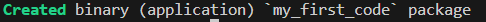
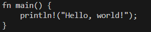
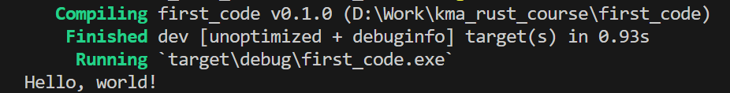
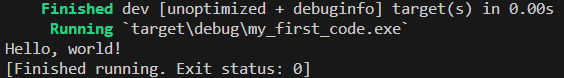

### 1

Перевіряємо яка версія Rust встановлена.

```
rustc --version
```

### 2

Якщо у вас версія нижче `rustc 1.81.0`

То оновіть Rust до актуальної версії

```
rustup update
```

### 3

Створюємо новий проект

```
cargo new my_first_code
```



### 4

Переходимо у папку з проектом

```
cd my_first_code
```

### 5

Можемо подивитись що знаходиться в файлі `Cargo.toml`

```
cat Cargo.toml
```


### 6

Можемо подивитись що знаходиться в файлі `main.rs`

```
cat src/main.rs
```



### 7

Запускаємо программу

```
cargo run
```



### 8

```
cargo install cargo-watch
```

### 9

```
cargo watch -cx "run"
```


