### 1
Оголосимо структуру для зберігання дати, зробимо це за допомогою кортежа. 
У функції `main()` створимо об'єкт структури `MyStruct`.  
Ми хочемо вивести у консоль цей об'єкт, але для цього нам треба додати трейт `Debug` він нам потрібен для того щоб цю структуру можна було вивести на екран. 
Також ми ще виводимо ділянку пам'яті де знаходиться цей об'єкт.

```rust
#[derive(Debug)]
struct MyStruct(i32, i32, i32);

fn main() {
    let my_struct = MyStruct(2023, 10, 11);
    println!("my_struct : {:?} @ {:p}", my_struct, &my_struct);
}
```

### 2 


### 3

Далі ми спробуємо написати функцію та у цю функцію ми передами структуру `MyStruct`.
Вивід у консоль ми перенесемо у цю функцію, а функцію будемо визивати з `main()`.

```rust

#[derive(Debug)]
struct MyStruct(i32, i32, i32);

fn main() {
    let my_struct = MyStruct(2023, 10, 11);
    my_function(my_struct);
}

fn my_function(my_struct: MyStruct) {
    println!("my_struct : {:?} @ {:p}", my_struct, &my_struct);
}
```
### 4
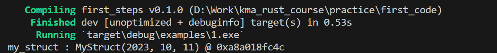


### 6

Спробуємо викликати `my_function()` двічі, і ми отримаємо помилку.

```rust
#[derive(Debug)]
struct MyStruct(i32, i32, i32);

fn main() {
    let my_struct = MyStruct(2023, 10, 11);
    my_function(my_struct);
    my_function(my_struct);
}

fn my_function(my_struct: MyStruct) {
    println!("my_struct : {:?} @ {:p}", my_struct, &my_struct);
}
```
### 7

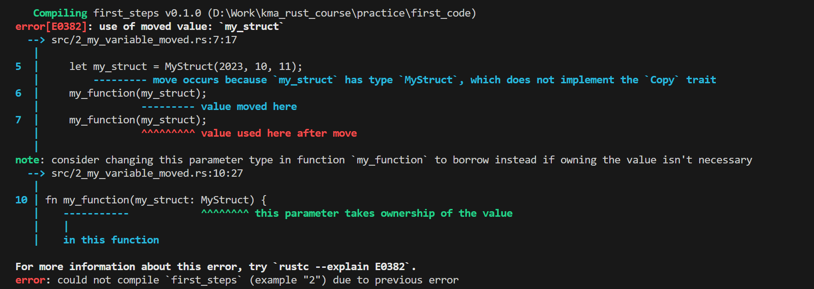


### 8

Ми створюємо якусь сутність, передаємо до функції і після не можемо її повторно використовувати, тому що передали по значеню.
Спробуємо виправити це прибравши другий виклик функції `my_function()` та просто викликавши на пряму `println!`.
Але це також не вийде, тому що перед цими ми вже передали нашу структуру у функцію `my_function()` при першому виклику.

```rust
#[derive(Debug)]
struct MyStruct(i32, i32, i32);

fn main() {
    let my_struct = MyStruct(2023, 10, 11);
    my_function(my_struct);
    // my_function(my_struct);
    println!("my_struct : {:?} @ {:p}", my_struct, &my_struct);
}

fn my_function(my_struct: MyStruct) {
    println!("my_struct : {:?} @ {:p}", my_struct, &my_struct);
}
```

### 9 

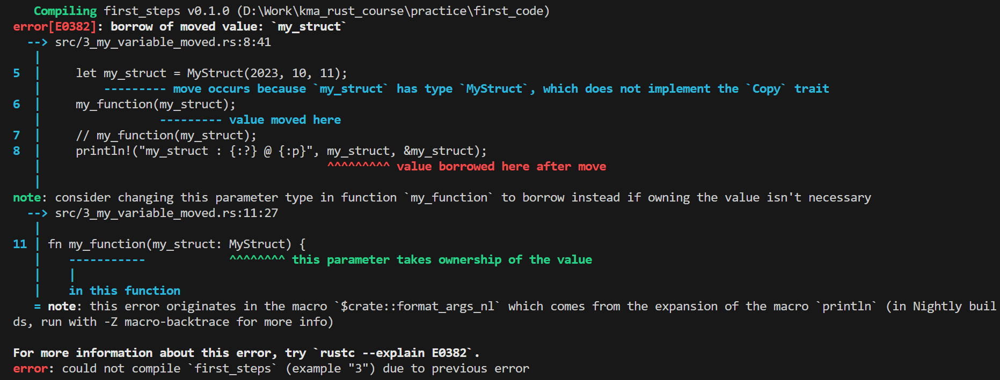

### 10 

Щоб ми могли викликати декілька разів підряд `my_function()` передавши їй одне й те саме значеня, нам треба додати можливість клонувати структуру. Додавши трейт `Clone` ми можемо отримати такий функціонал.

```rust
#[derive(Debug, Clone)]
struct MyStruct(i32, i32, i32);

fn main() {
    let my_struct = MyStruct(2023, 10, 11);
    my_function(my_struct.clone());
    my_function(my_struct.clone());
    println!("my_struct : {:?} @ {:p}", my_struct, &my_struct);
}

fn my_function(my_struct: MyStruct) {
    println!("my_struct : {:?} @ {:p}", my_struct, &my_struct);
}
```

### 12
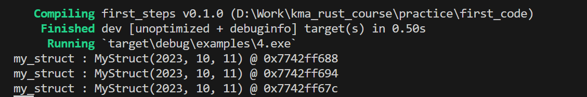


### 11  

Спробуємо вирішити цю проблему іншим шляхом. Це можна зробити за допомогою посилань.
Треба змінити сигнатуру функції, щоб вона приймала посилання на структуру. Та передавати у `my_function()` посилання. 
Так як зараз ми тричі користуємось однією структурою і просто передаємо посилання на неї, тобто тричі буде виведено одинакове посилання на комірку пам'яті.
```rust
#[derive(Debug, Clone)]
struct MyStruct(i32, i32, i32);

fn main() {
    let my_struct = MyStruct(2023, 10, 11);
    my_function(&my_struct);
    my_function(&my_struct);
    println!("my_struct : {:?} @ {:p}", my_struct, &my_struct);
}

fn my_function(my_struct: &MyStruct) {
    println!("my_struct : {:?} @ {:p}", my_struct, my_struct);
}
```

### 12  
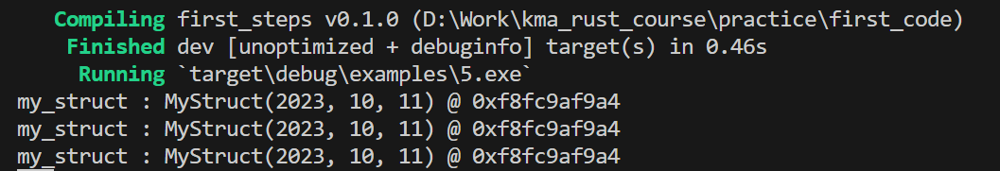

### 13

Спробуємо вирішити цю проблему ще одним шляхом. Додавши трейт `Copy`. 
```rust
#[derive(Debug, Copy)]
struct MyStruct(i32, i32, i32);

fn main() {
    let my_struct = MyStruct(2023, 10, 11);
    my_function(my_struct);
    my_function(my_struct);
    println!("my_struct : {:?} @ {:p}", my_struct, &my_struct);
}

fn my_function(my_struct: MyStruct) {
    println!("my_struct : {:?} @ {:p}", my_struct, &my_struct);
}
```

### 14 
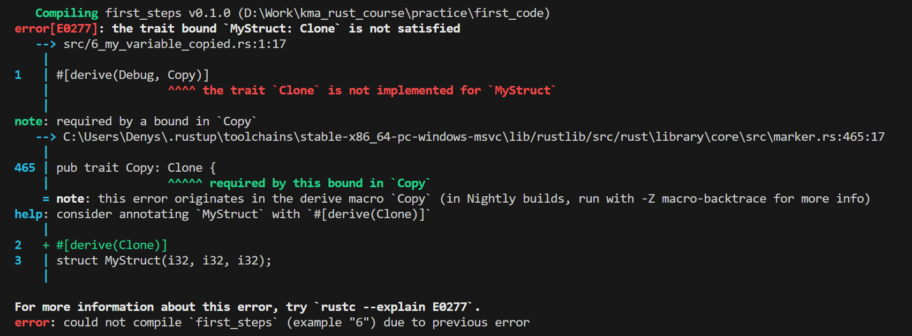

### 15

Компілятор підказує нам, що ми не можемо реалізувати трейт `Copy` на структуру, якщо для неї не реалізован трейт `Clone`.
Тут нам не потрібно вручну прописувати методи копіювання як було в прикладі з `Clone`. Копіювання реалізовується неявно, структура копіюється коли не може бути просто передвинута.


```rust
#[derive(Debug, Copy, Clone)]
struct MyStruct(i32, i32, i32);

fn main() {
    let my_struct = MyStruct(2023, 10, 11);
    my_function(my_struct);
    my_function(my_struct);
    println!("my_struct : {:?} @ {:p}", my_struct, &my_struct);
}

fn my_function(my_struct: MyStruct) {
    println!("my_struct : {:?} @ {:p}", my_struct, &my_struct);
}

```

### 16
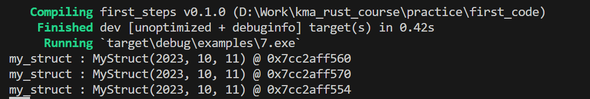


### 17

Спробуємо додати до дати 100 років.

```rust
#[derive(Debug, Copy, Clone)]
struct MyStruct(i32, i32, i32);

fn main() {
    let my_struct = MyStruct(2023, 10, 11);
    my_function(my_struct);
    my_struct.0 += 100;
    my_function(my_struct);
    println!("my_struct : {:?} @ {:p}", my_struct, &my_struct);
}

fn my_function(my_struct: MyStruct) {
    println!("my_struct : {:?} @ {:p}", my_struct, &my_struct);
}
```

### 18
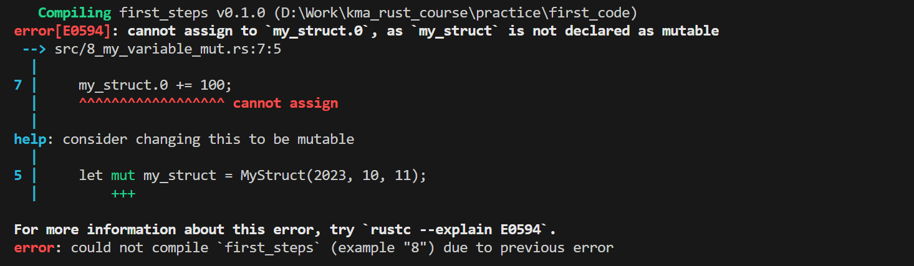
### 17
Ми не можемо це зробити, так як наша структура не є мутабельною.
Зробимо її мутабельною та подивимся що вийде.

```rust
#[derive(Debug, Copy, Clone)]
struct MyStruct(i32, i32, i32);

fn main() {
    let mut my_struct = MyStruct(2023, 10, 11);
    my_function(my_struct);
    my_struct.0 += 100;
    my_function(my_struct);
    println!("my_struct : {:?} @ {:p}", my_struct, &my_struct);
}

fn my_function(my_struct: MyStruct) {
    println!("my_struct : {:?} @ {:p}", my_struct, &my_struct);
}

```

### 18
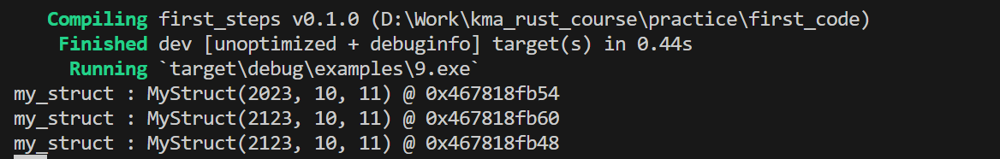
### 17

Тепер спробуємо додати 100 років вже всередині функції `my_function()`.
```rust
#[derive(Debug, Copy, Clone)]
struct MyStruct(i32, i32, i32);

fn main() {
    let mut my_struct = MyStruct(2023, 10, 11);
    my_function(my_struct);
    my_function(my_struct);
    println!("my_struct : {:?} @ {:p}", my_struct, &my_struct);
}

fn my_function(my_struct: MyStruct) {
    my_struct.0 += 100;
    println!("my_struct : {:?} @ {:p}", my_struct, &my_struct);
}

```

### 18
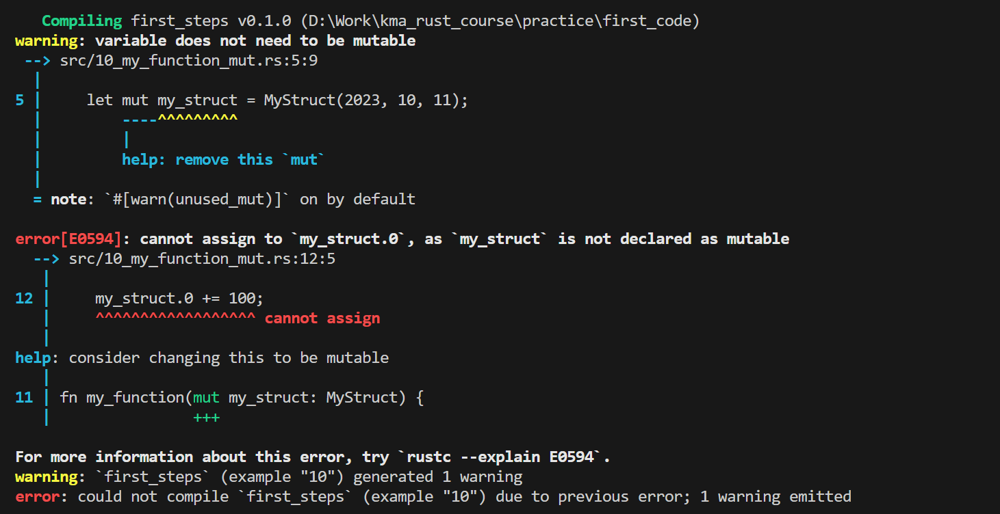
### 17

Ми не можемо це зробити так як функція приймає не мутабельну змінну, отже змінити її ми не можемо. 
Треба виправити сігнатуру функції щоб вона приймала мутабельну змінну.

```rust
#[derive(Debug, Copy, Clone)]
struct MyStruct(i32, i32, i32);

fn main() {
    let mut my_struct = MyStruct(2023, 10, 11);
    my_function(my_struct);
    my_function(my_struct);
    println!("my_struct : {:?} @ {:p}", my_struct, &my_struct);
}

fn my_function(mut my_struct: MyStruct) {
    my_struct.0 += 100;
    println!("my_struct : {:?} @ {:p}", my_struct, &my_struct);
}

```

### 18
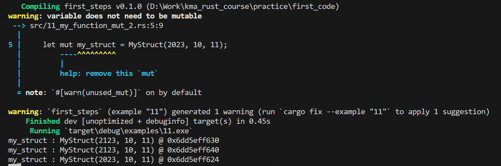
### 17
Тепер спробуємо передавати структуру яка знаходиться на одній ділянці пам'яті у всі викликли функції `my_function()`.
Щоб поступово додавати їй по 100 років,
додамо у функцію `my_function()` можливість приймати мутабельне посилання.

```rust
#[derive(Debug, Copy, Clone)]
struct MyStruct(i32, i32, i32);

fn main() {
    let mut my_struct = MyStruct(2023, 10, 11);
    my_function(my_struct);
    my_function(my_struct);
    println!("my_struct : {:?} @ {:p}", my_struct, &my_struct);
}

fn my_function(my_struct: &mut MyStruct) {
    my_struct.0 += 100;
    println!("my_struct : {:?} @ {:p}", my_struct, &my_struct);
}

```

### 18
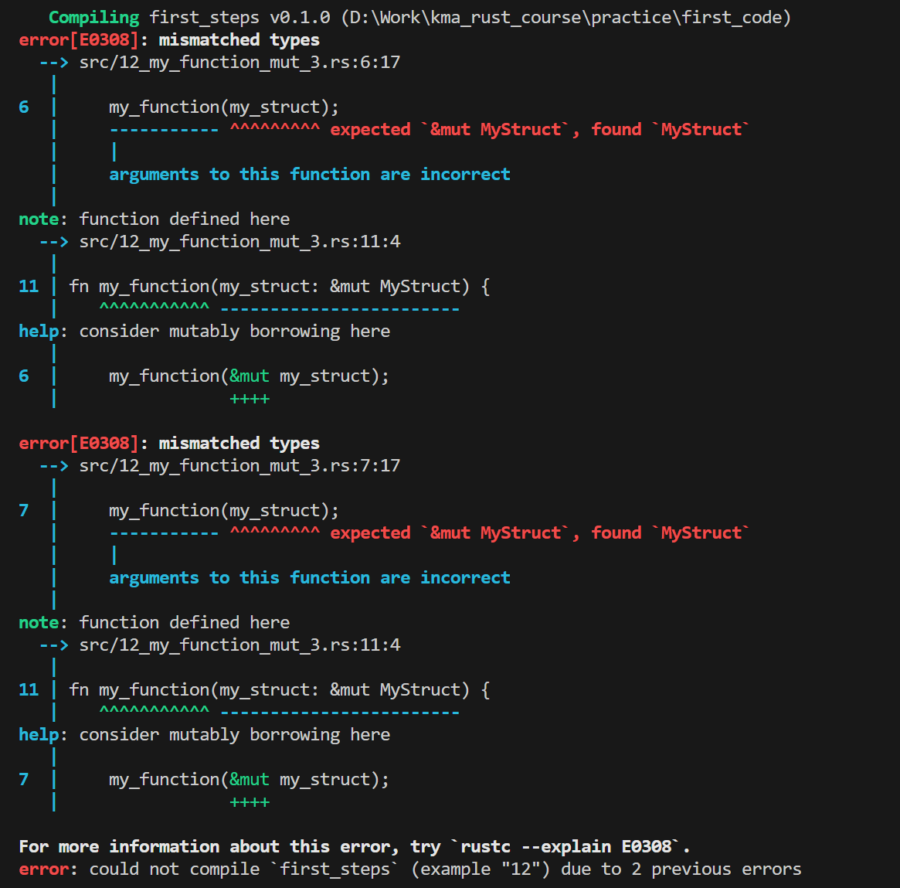

### 17

Якщо функція приймає мутабельне посилання то ми маємо передавати також мутабельне посилання. 
Виправимо це.

```rust
#[derive(Debug, Copy, Clone)]
struct MyStruct(i32, i32, i32);

fn main() {
    let mut my_struct = MyStruct(2023, 10, 11);
    my_function(&mut my_struct);
    my_function(&mut my_struct);
    println!("my_struct : {:?} @ {:p}", my_struct, &my_struct);
}

fn my_function(my_struct: &mut MyStruct) {
    my_struct.0 += 100;
    println!("my_struct : {:?} @ {:p}", my_struct, my_struct);
}

```

### 18
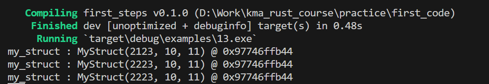


