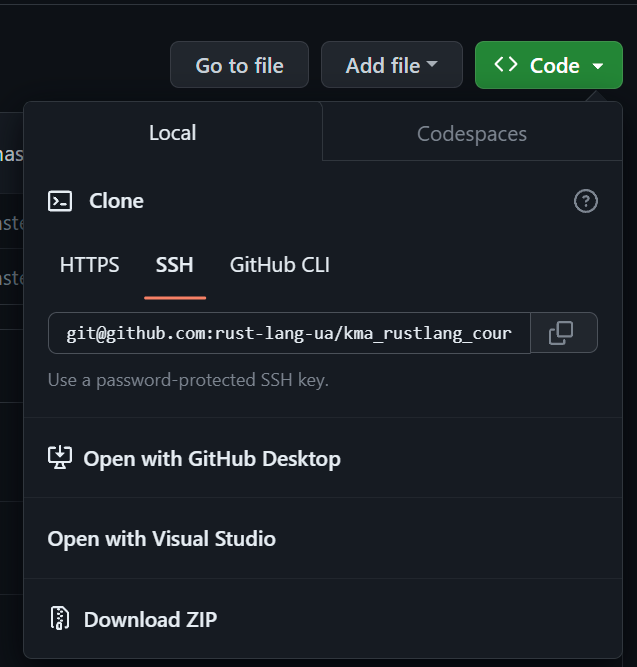
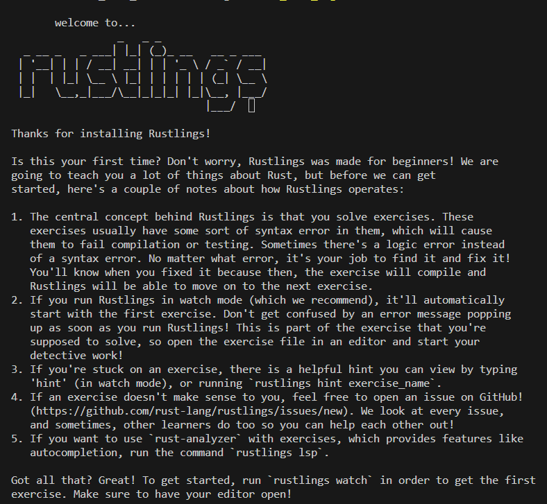

### 0

Якщо у вас ще не встановлений git на машину то будь ласка зробіть це.
[Інструкція](https://git-scm.com/book/en/v2/Getting-Started-Installing-Git) по встановленю git.

### 1

Копіюємо посилання для клона по SSH/HTTP



### 2

Відкриваємо командну строку переходимо в папку куди хочемо зклонувати та виконуємо команду.

```
git clone git@github.com:rust-lang-ua/kma_rustlang_course_Oleksii_Akhmadov.git
```

### 3

Переходимо в середину репозиторія який ми тільки що зклонували

```
cd kma_rustlang_course_Oleksii_Akhmadov
```

### 4

Та переходимо у папку з rustlings

```
cd rustlings
```

### 5

Встановлюємо rustlings

```
cargo install --force --path .
```

### 6

Перевіряємо чи встановився rustlings коректно

```
learn_rust_together
```



### 7

Команда яка виведе список існуючих команд

```
learn_rust_together help
```

### 8

Команда яка виведе список завдань

```
learn_rust_together list
```

### 9

Команда за допомогою якої ми можемо відслідковувати свій прогресс

```
learn_rust_together watch
```

### 10

Переходимо у файл: `rustlings\exercises\intro\intro1.rs` це наше перше завдання.

### 11

На 8 рядку виправляємо коментар

`// I AM NOT DONE` на `// I AM DONE`

##

- Щоб просуватися далі по завданням, не забувайте змінювати `// I AM NOT DONE` на `// I AM DONE`
