### 0
Для початку виконання цієї практичної треба виконати декілька умов:

1.  Згенеруйте та прив'яжіть SSH key до свого GitHub акаунта. [Інструкція](https://docs.github.com/en/authentication/connecting-to-github-with-ssh/generating-a-new-ssh-key-and-adding-it-to-the-ssh-agent)


### 1

Створюємо новий проект:
```
cargo new my_parser_kma_group_1
```

### 2

Заходимо в папку з тільки що створеним проектом:
```
cd my_parser_kma_group_1
```

### 3

Додаємо в залежності проекту крейт  `peg`:
```
cargo add peg
```

### 4

Заходимо на сторінку крейту на [crates.io](https://crates.io/crates/peg):

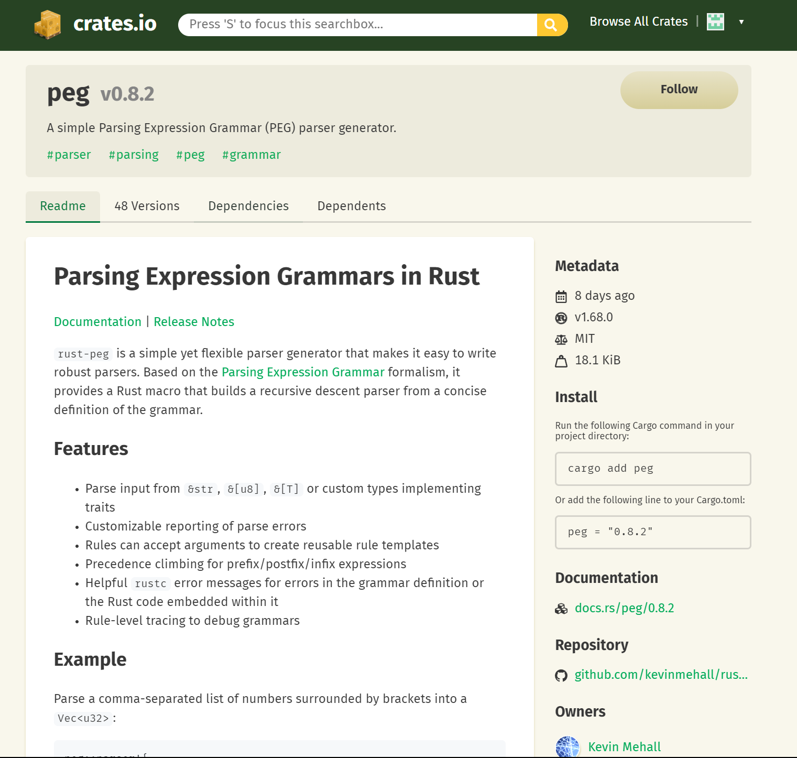

### 5

Документацію можна дослідити [тут](https://docs.rs/peg/0.8.2/peg/) .

### 6

Копіюємо код приклад з документації крейта у свій `main.rs`:

```rust
peg::parser!{
    grammar list_parser() for str {
      rule number() -> u32
        = n:$(['0'..='9']+) {? n.parse().or(Err("u32")) }
  
      pub rule list() -> Vec<u32>
        = "[" l:(number() ** ",") "]" { l }
    }
  }
  
  pub fn main() {
      println!("{:?}", list_parser::list("[1,1,2,3,5,8]"));
  }
```

### 7

Потім треба створити Readme.md в якому має бути наповненя по такому шаблону:

- Заголовок
- Короткий опис
- Картинка
- Приклад коду

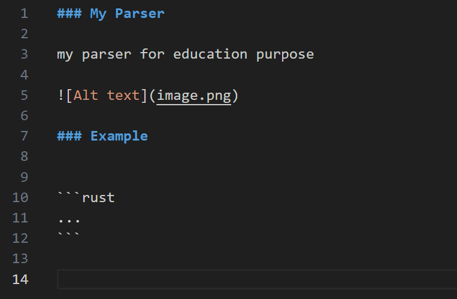

### 8

Тепер треба створити `lib.rs` файл за шляхом `"my_parser_kma_group_1/src/lib.rs"`.

### 9

Перенесемо в `lib.rs` код нашого парсера:

```rust
peg::parser! {
  pub grammar list_parser() for str {
    rule number() -> u32
      = n:$(['0'..='9']+) {? n.parse().or(Err("u32")) }

    pub rule list() -> Vec<u32>
      = "[" l:(number() ** ",") "]" { l }
  }
}
```

### 10

В `main.rs` залишається тільки:


```rust
pub fn main() {
    println!("{:?}", list_parser::list("[1,1,2,3,5,8]"));
}
```

### 11

Тепер треба імпортувати код нашого парсера. Додаєм `use my_parser_kma_group_1::*;` на початок файлу:

```rust
use my_parser_kma_group_1::*;

pub fn main() {
    println!("{:?}", list_parser::list("[1,1,2,3,5,8]"));
}

```

### 12

Перевіряємо, чи все збирається:

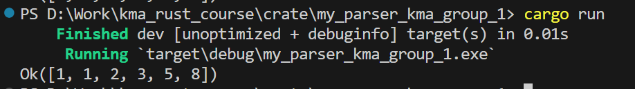


Тепер треба додати поля в Cargo.toml, вони необхідні для того, щоб можна було завантажити свій крейт на `crates.io`:

- license = "MIT"
- description = "A brief description of your crate"

### 13

Тепер `Cargo.toml` має виглядати так:

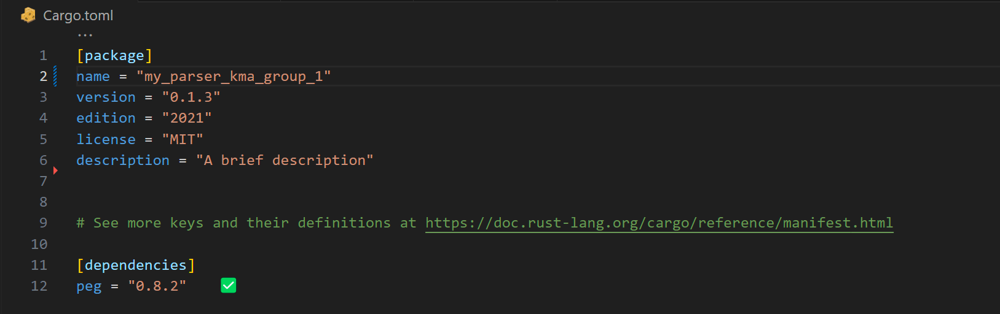

### 14

Тепер створюємо нову GitHub репозиторію:

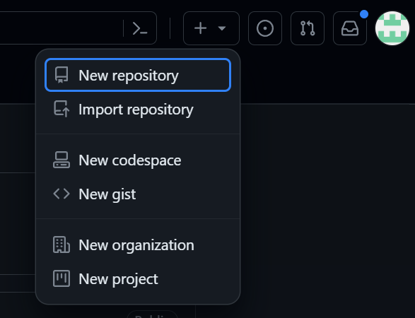

### 15 

Пишемо ім'я репозиторія та робимо його публічним.

### 16

Коли створили репозиторій, треба по  інструкції, яку дає GitHub, завантажити свій проект у нього.

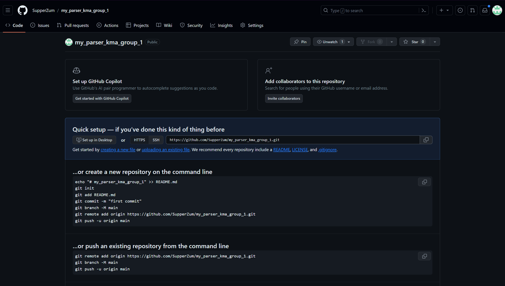

### 17

Ініціюємо репозиторій Git локально.
Обов'язково знаходячись у папці з проектом.

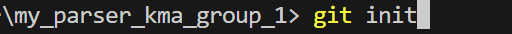
```
git init
```
### 18
Додаємо всі зміни, щоб вони відслідковувались гітом:
```
git add --all
```
### 19
Додаємо зміни в коміт:
```
git commit -m "initial commit"
```
### 20
Виконуємо перейменування поточної гілки в master:
```
git branch -M master
```
### 21

Виконуємо додавання віддаленого сховища з іменем origin до вашого локального сховища Git. Це віддалене сховище пов'язується з сховищем на GitHub.
```
git remote add origin git@github.com:SupperZum/my_parser_kma_group_1.git
```
### 22
Пушим зміни на GitHub:
```
git push -u origin master
```
### 23

Оновлюємо сторінку свого репозиторія і бачимо свої зміни.

### 24

Переходимо на [crates.io](https://crates.io/crates).

### 25
Логінимось через свій GitHub.

### 26

Заходимо у `account settings` та генеруємо токен:

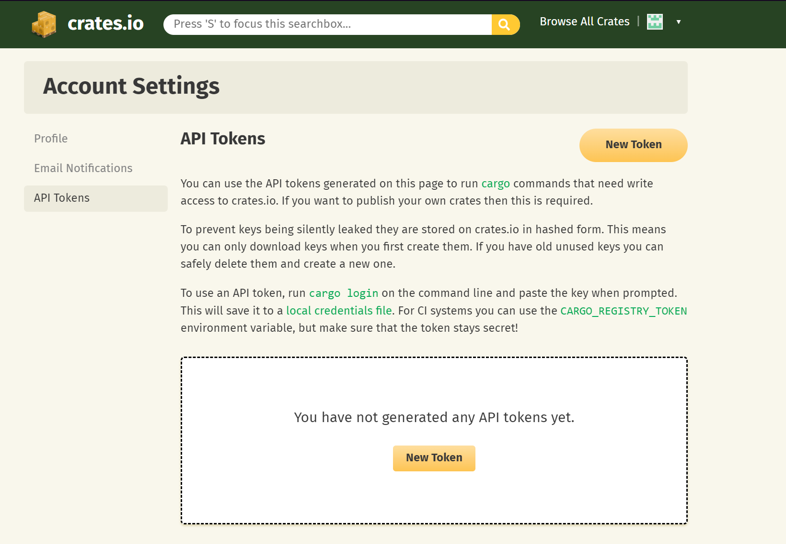

### 27
Ставимо прапорці, як на зображенні:

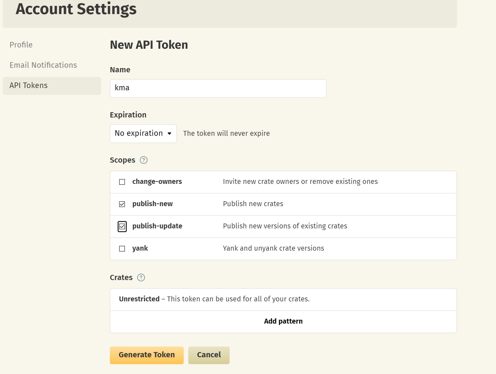


### 28
Також треба додати пошту у [профілі](https://crates.io/settings/profile):

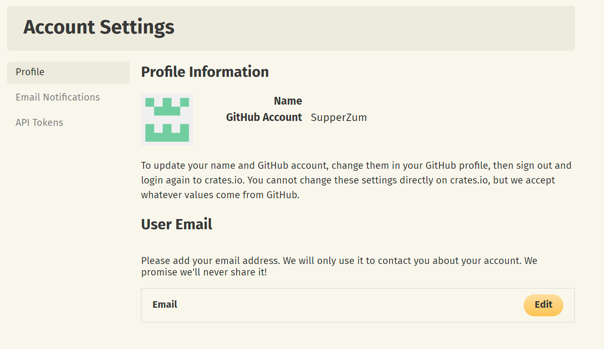

### 29

Верифікуємо пошту.

### 30

Тепер можемо залогінитись у консолі за допомогою отриманого токена:
```
cargo login
```

### 31

Вас попросять вставити токен у консоль. Зробіть це.

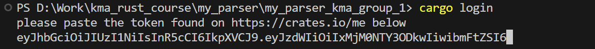

### 32

Ви успішно авторизувались

Тепер можна опубліковати свій крейт на платформу, за допомогою:
```
cargo publish
```

## Формальні вимоги
Отже для того щоб вам зарахували цю практичну, треба щоб у вас було:

- Посилання на GitHub репозиторію.
- Посилання на ваш крейт на crates.io
- Наявність Readme.md файлу з описовм крейта.
- Наявність lib.rs файлу.
- Наявність main.rs файлу.
- Наявність правильно заповненого Cargo.toml файлу