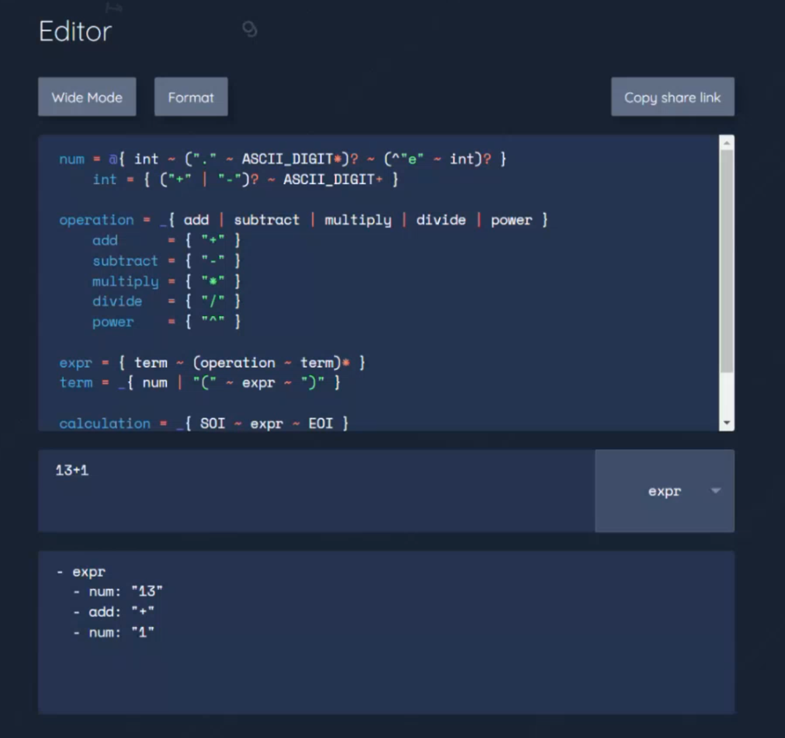
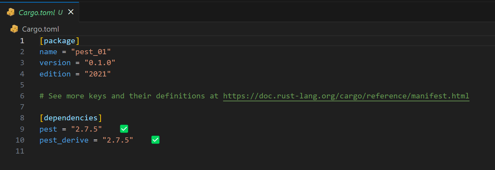
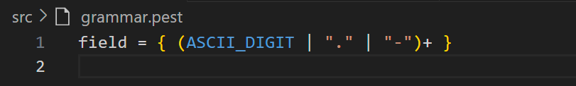
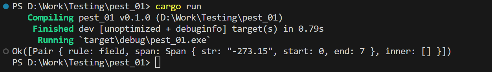
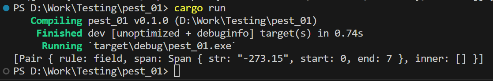
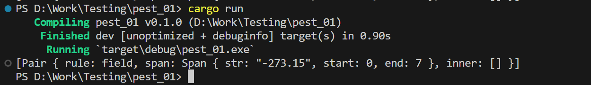
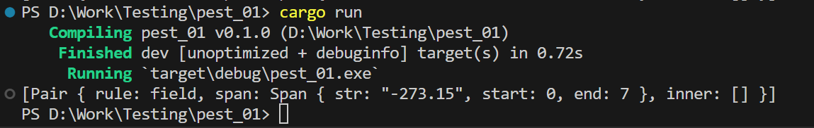
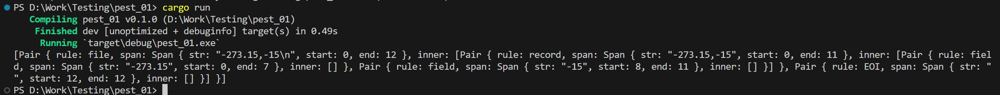

### 1 

Знайомимось з крейтом Pest на [crates.io](https://crates.io/crates/pest) та його репозиторієм на [github](https://github.com/pest-parser/pest).

Бачимо гарний опис та як їм користуватись. Гарний приклад того як писати опис вашого парсера.

### 2

Pest дає нам можливість погратися з граматикою у [редакторі](https://pest.rs/#editor).

Наприклад, ми можемо взяти якусь граматику, ввести якийсь вираз. І отримаємо результат парсингу цього виразу:

```pest

WHITESPACE = _{ " " | "\t" | "\r" | "\n" }

num        = { ASCII_DIGIT+ }
add        = { "+" }
subtract   = { "-" }
multiply   = { "*" }
divide     = { "/" }
power      = { "^" }

operation  = _{ add | subtract | multiply | divide | power }
expr       = { term ~ (operation ~ term)* }
term       = { num | "(" ~ expr ~ ")" }

calculation = { SOI ~ expr ~ EOI }
```




### 3

Також про Pest є книга - [A thoughtful introduction to the pest parser](https://pest.rs/book/examples/csv.html)
Пробігшись по ній, навіть не маючи теоритичної бази, можна розібратися що і до чого.
Сьогодні ми розбираємось із цією книгою. Потім, завершивши її, з отриманими знаннями, ви зможете впоратись з наступною частиною вашої курсової роботи.

### 4

Я створю новий крейк:

```
cargo new pest_01
```

```
cd pest_01
```


### 5

Додамо залежністі `pest` та `pest_derive`:

```
cargo add pest
```
```
cargo add pest_derive
```
### 6

Відкривши текстовий редактор, млжна побачити що у файлі Cargo.toml з'явились нові залежності `pest` та `pest_derive` :



### 7

Створимо новий файл граматики за шляхом `src/grammar.pest`.

Та додамо в нього просту граматику, яку нам дає книга :

```
field = { (ASCII_DIGIT | "." | "-")+ }
```

### 8



Зверніть увагу що в мене граматика підсвітилась. І, якщо ви хочете щоб у вас теж вона підсвічувалась, і текстовий редактор вам допомагав, то ви можете додати плагін [`Pest IDE Tools`](https://marketplace.visualstudio.com/items?itemName=pest.pest-ide-tools).


### 9

Граматика в нас є, тепер ми переходимо у `main.rs` файл. 

Створюємо структуру граматики, додаємо дерав макрос `#[derive(Parser)]`, та додаємо відносний шлях до самої граматики `#[grammar = "./grammar.pest"]`:

```rust
use pest_derive::Parser;

#[derive(Parser)]
#[grammar = "./grammar.pest"]
pub struct Grammar;

fn main() {

}
```
Перевіряєми чи все компілюється:


### 10

Далі маємо перевірити що парсер працює, для цього потрібно щось спарсити.

Додаємо трейт `use pest::Parser;`, він потрібен для асоціативної функції `parse()`, та додаємо у `main()` функцію це:
```rust
fn main() {
    let got = Grammar::parse(Rule::field, "-273.15");
    println!("{:?}", got);
}
```


### 11

Перевіряємо, що все працює:



Але ми не оброблюємо помилку, додамо обробленя помилки у функцію `main()`:

```rust 
fn main() -> Result< (), pest::error::Error<Rule> > {
    let got = Grammar::parse(Rule::field, "-273.15")?;
    println!("{:?}", got);

    Ok(())
}
```

Тепер вже краще:




### 12

На цьому етапі потрібно додати ще 1 бібліотеку, яку рекомендовано використати в роботі.
Це крейт для обробки помилок [anyhow](https://crates.io/crates/anyhow).

```
cargo add anyhow
```

### 13

У `anyhow` є власна реалізація `Result`, тобто це той же `Result` але непотрібно вказувати яка саме посилка повертається.

Замінемо Result:

```rust
fn main() -> anyhow::Result< () > {
    let got = Grammar::parse(Rule::field, "-273.15")?;
    println!("{:?}", got);

    Ok(())
}
```

### 14

Наступним кроком ми зробимо те що рекомендується у книзі: ускладнем трошки правило грамитики. 
Додаєм ще одне правило, яке використовує попереднє правило, і додаєм кореневе правило, яке теж використовує попереднє правило:

```
field = { (ASCII_DIGIT | "." | "-")+ }
record = { field ~ ("," ~ field)* }
file = { SOI ~ (record ~ ("\r\n" | "\n"))* ~ EOI }
```

### 15

Зберігаємо і перевіряємо чи все по старому працює:




### 16

Тепер трохи ускладнемо вхідні дані:

```
let got = Grammar::parse(Rule::field, "-273.15,-15\n")?;
```



Але результат не змінився.

### 17

Результат незмінився, тому що ми не змінили правило за яким будемо парсити.
Давайте зробимо це:

```rust
let got = Grammar::parse(Rule::file, "-273.15,-15\n")?;
```
Бачимо успішний результат:



```
[Pair { rule: file, span: Span { str: "-273.15,-15\n", start: 0, end: 12 },
  inner: [
    Pair { rule: record, span: Span { str: "-273.15,-15", start: 0, end: 11 },
      inner: [
        Pair { rule: field, span: Span { str: "-273.15", start: 0, end: 7 }, inner: [] },
        Pair { rule: field, span: Span { str: "-15", start: 8, end: 11 }, inner: [] }
      ]
    },
    Pair { rule: EOI, span: Span { str: "", start: 12, end: 12 }, inner: [] }
  ]
}]
```

