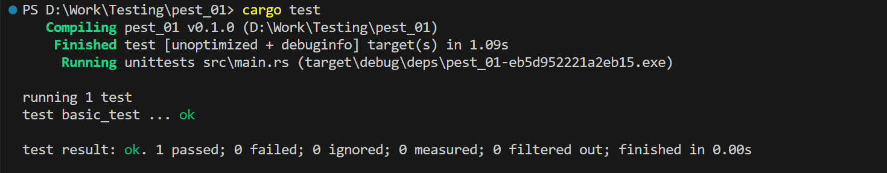
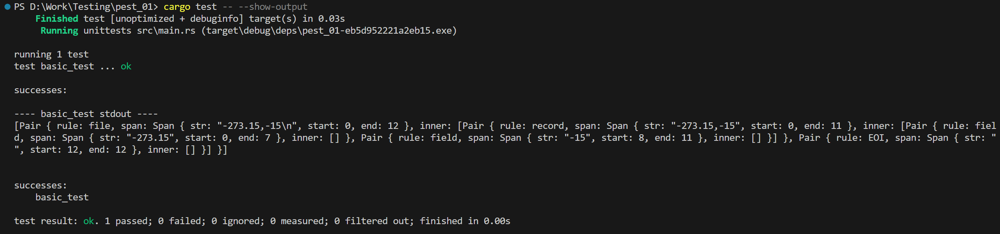
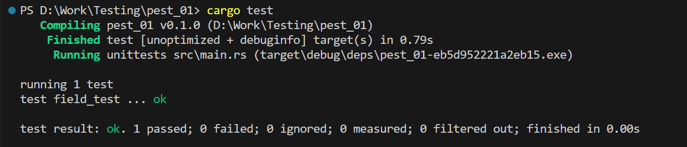
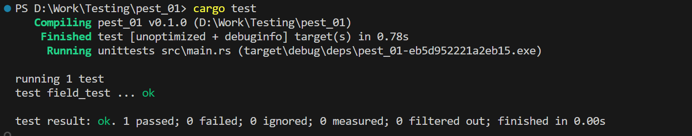
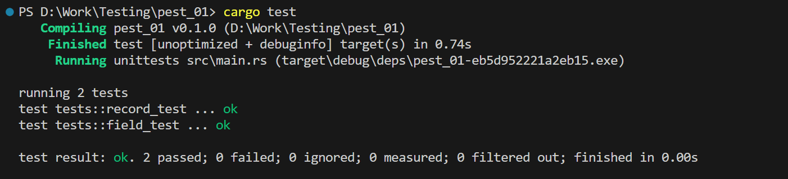
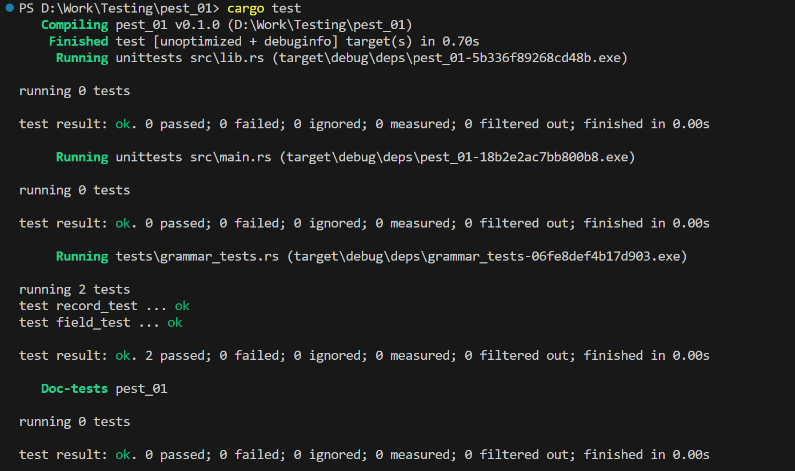

### 1

Тепер розглянемо як це перетворити в тести.

Юніт-тести: Це окремі тести для невеликих функціональних одиниць, таких як окремі правила граматики в парсері. Наприклад, тестування field чи record є юніт-тестами, бо вони перевіряють конкретні правила без взаємодії з іншими частинами. У цьому прикладі юніт-тести дозволяють швидко знайти проблеми в кожному з правил граматики, ще до того, як ці правила будуть об'єднані для обробки більш складних виразів.

Інтеграційні тести: Вони спрямовані на перевірку взаємодії кількох модулів одночасно. У разі інтеграційних тестів для парсера pest, перевіряються об'єднані правила, як-от file, що включає record і field. Цей тест дозволяє побачити, як граматика обробляє вхідні дані як єдине ціле.

Беремо все що писали в `main()` і переносимо в тест з назвою `basic_test()`:

```rust
fn main() -> anyhow::Result< () > {

    Ok(())
}

#[test]
fn basic_test() -> anyhow::Result< () > {
    let got = Grammar::parse(Rule::file, "-273.15,-15\n")?;
    println!("{:?}", got);

    Ok(())
}
```

### 2

Запускаємо тест за допомогою:

```
cargo test
```



### 3

Але ми не бачимо виводу `println!`. Щоб це виправити, треба запустити тести з флагом --show-output:

```
cargo test -- --show-output
```

```
[Pair { rule: file, span: Span { str: "-273.15,-15\n", start: 0, end: 12 },
  inner: [
    Pair { rule: record, span: Span { str: "-273.15,-15", start: 0, end: 11 },
      inner: [
        Pair { rule: field, span: Span { str: "-273.15", start: 0, end: 7 }, inner: [] },
        Pair { rule: field, span: Span { str: "-15", start: 8, end: 11 }, inner: [] }
      ]
    },
    Pair { rule: EOI, span: Span { str: "", start: 12, end: 12 }, inner: [] }
  ]
}]
```



### 4

Але зараз цей тест нічого не перевіряє. Щоб тест був повноцінним, потрібно зробити перевірки (чи збігаються наші очікування з тим що ми отримаємо).

Зробимо це за допомогою макроса `assert_eq!( )`, він порівнює сутності. Для цього нам треба отримати один `Pair`, щоб можна було його з чимось порівняти.

Перетворимо ітератор по `Pair`, який нам вертає `parse()`, в одну `Pair` та перетворимо `Option<>` у `Result<>`, який вертає нам метод `next()`.

За допомогою метода `as_str()` у `Pair`, ми можемо отримати наш пропаршений рядок. Також ми використовуємо метод `as_span()`, він показує початок і кінець де починається і закінчується ця ділянка в тексті яка відповідає правилу.

```rust
#[test]
fn field_test() -> anyhow::Result< () > {

    let pair = Grammar::parse(Rule::field, "-273.15")?.next().ok_or_else( || anyhow!( "no pair" ) )?;
    assert_eq!( pair.as_str(), "-273.15" );
    assert_eq!( pair.as_span().start(), 0 );
    assert_eq!( pair.as_span().end(), 7 );

    Ok(())
}
```

і треба додати макрос `anyhow`:

```
use anyhow::anyhow;
```

### 5

Запускаємо тест і бачимо що він проходить:



### 6

Додамо ще перевірку коректності роботи нашого парсера, якщо він не може розпарсити текст:

```rust
let pair = Grammar::parse(Rule::field, "x");
assert!(pair.is_err());

let pair = Grammar::parse(Rule::field, "");
assert!(pair.is_err());
```

Тест проходить:



### 7

Також напишемо тест для правила `record`:

```rust
#[test]
fn record_test() -> anyhow::Result< () > {

    let pair = Grammar::parse(Rule::record, "-273.15,99")?.next().ok_or_else( || anyhow!( "no pair" ) )?;
    assert_eq!( pair.as_str(), "-273.15,99" );
    assert_eq!( pair.as_span().start(), 0 );
    assert_eq!( pair.as_span().end(), 10 );

    let pair = Grammar::parse(Rule::record, "");
    assert!( pair.is_err() );

    Ok( () )
}
```

### 8

Аналогічний тест треба написати для третього правила `file`. І, в першу чергу, треба тестувати те чим це правило відрізняєтся від його складових.

### 9

Як правильно організовувати юніт тести?
Треба обгорнути тести у окремий модуль для них:

```rust
#[cfg(test)]
mod tests {

}
```

Щоб при збірці нашого проекту тести не збирались, а збирались тільки тоді, коли ми на пряму викликаємо їх.

Виходить ось так:

```rust
#[cfg(test)]
mod tests {


    #[test]
    fn field_test() -> anyhow::Result< () > {

        let pair = Grammar::parse(Rule::field, "-273.15")?.next().ok_or_else( || anyhow!( "no pair" ) )?;
        assert_eq!( pair.as_str(), "-273.15" );
        assert_eq!( pair.as_span().start(), 0 );
        assert_eq!( pair.as_span().end(), 7 );


        let pair = Grammar::parse(Rule::field, "x");
        assert!(pair.is_err());

        let pair = Grammar::parse(Rule::field, "");
        assert!(pair.is_err());

        Ok(())
    }


    #[test]
    fn record_test() -> anyhow::Result< () > {

        let pair = Grammar::parse(Rule::record, "-273.15,99")?.next().ok_or_else( || anyhow!( "no pair" ) )?;
        assert_eq!( pair.as_str(), "-273.15,99" );
        assert_eq!( pair.as_span().start(), 0 );
        assert_eq!( pair.as_span().end(), 10 );

        let pair = Grammar::parse(Rule::record, "");
        assert!( pair.is_err() );

        Ok( () )
    }

}


```

### 10

Але тепер, коли це окремий модуль, нам недоступні ці імпорти:

```
use pest_derive::Parser;
use pest::Parser;
use anyhow::anyhow;
```

тому потрібно додати їх модуль з тестами:

```rust
use super::*;
```

### 11

І все працює:



### 12

Тепер перетворимо ці тести у інтеграційні. Для цього потрібно створити `lib.rs` файл, і перенести наш код туди.

І в нас вийде 2 файли: `main.rs` та `lib.rs`:

`main.rs`:

```rust
use pest::Parser;
use anyhow::anyhow;
use pest_01::*;

fn main() -> anyhow::Result< () > {
    let pair = Grammar::parse(Rule::field, "-273.15")?.next().ok_or_else( || anyhow!( "no pair" ) )?;
    dbg!(pair);
    Ok(())
}
```

`lib.rs`:

```rust
use pest_derive::Parser;


#[derive(Parser)]
#[grammar = "./grammar.pest"]
pub struct Grammar;
```

### 13

Тепер треба перенести самі тести. Створимо, папку `tests` в корені нашого проекту `pest_01/tests` і створити в ній файл `grammar_tests.rs`,

в якому буде наступне:

```rust
use pest::Parser;
use anyhow::anyhow;
use pest_01::*;

#[test]
fn field_test() -> anyhow::Result< () > {


    // Тестуємо простий числовий вхід
    let pair = Grammar::parse(Rule::field, "-273.15")?.next().ok_or_else( || anyhow!( "no pair" ) )?;
    assert_eq!( pair.as_str(), "-273.15" );
    assert_eq!( pair.as_span().start(), 0 );
    assert_eq!( pair.as_span().end(), 7 );

    // Тест на неправильний вхід
    let pair = Grammar::parse(Rule::field, "x");
    assert!(pair.is_err());
    // Тест на порожній вхід
    let pair = Grammar::parse(Rule::field, "");
    assert!(pair.is_err());

    Ok(())
}


#[test]
fn record_test() -> anyhow::Result< () > {

    // Тестуємо правильний формат запису
    let pair = Grammar::parse(Rule::record, "-273.15,99")?.next().ok_or_else( || anyhow!( "no pair" ) )?;
    assert_eq!( pair.as_str(), "-273.15,99" );
    assert_eq!( pair.as_span().start(), 0 );
    assert_eq!( pair.as_span().end(), 10 );

    // Неправильний запис без чисел
    let pair = Grammar::parse(Rule::record, "");
    assert!( pair.is_err() );

    Ok( () )
}

```

Ми можемо прибрати:

```
#[cfg(test)]
mod tests {

}
```

Тому що в юніт тестах це використовувалось щоб программа не збирала тести, коли цього не треба. І зверталась до них тільки тоді, коли ми звертаємось напряму до тестів. Але тепер все що у папці `tests`, збирається тільки тоді коли ми викликаємо тести.

Але тепер треба буде додати імпорти:

```rust
use pest::Parser;
use anyhow::anyhow;
use pest_01::*;
```

### 14

І тепер можна запустити тести і побачити що вони всі проходять:



### 15

Додамо кілька додаткових інтеграційних тестів для кращого розуміння того, як наш парсер працює з різними типами вхідних даних. Це допоможе виявити неточності у логіці парсера та забезпечить більшу перевірку функціоналу.

```rust
#[test]
fn file_test_single_record() -> anyhow::Result<()> {
    // Тестуємо файл з одним записом
    let pair = Grammar::parse(Rule::file, "-273.15,99\n")?.next().ok_or_else(|| anyhow!("no pair"))?;
    assert_eq!(pair.as_str(), "-273.15,99\n");

    Ok(())
}

#[test]
fn file_test_multiple_records() -> anyhow::Result<()> {
    // Тестуємо файл з кількома записами
    let pair = Grammar::parse(Rule::file, "-273.15,99\n36.6,98.6\n")?.next().ok_or_else(|| anyhow!("no pair"))?;
    assert_eq!(pair.as_str(), "-273.15,99\n36.6,98.6\n");

    Ok(())
}

#[test]
fn file_test_incorrect_format() {
    // Тестуємо некоректний формат, наприклад, без коми між числами
    let pair = Grammar::parse(Rule::file, "-273.15 99\n");
    assert!(pair.is_err());

    // Відсутність нового рядка між записами
    let pair = Grammar::parse(Rule::file, "-273.15,99-36.6,98.6");
    assert!(pair.is_err());
}
```
